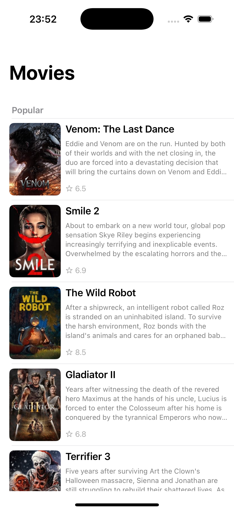
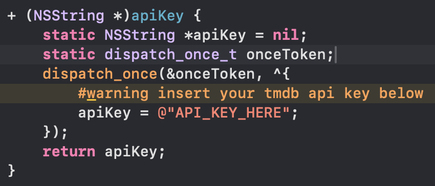

# TMDb Objective-C

    
    

#### This project features a movie list generated using TMDb API. When a movie is selected, the user is navigated to a details page with additional information. The project was developed in Objective-C, using UIKit with ViewCode for the user interface and the MVVM-C architecture for code organization.

#### Feel free to clone it and test it by yourself!

---

## Don't forget to get your API key at this link: <a href="https://developer.themoviedb.org/reference/intro/getting-started">TMDb API</a>

    

